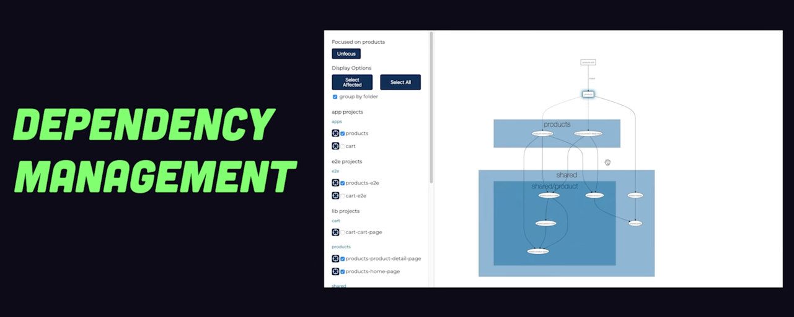

 
PR Reviews

Code Review is a powerful tool that:

- Helps team members adapt their mental model of the system as it’s changing
- Ensures the change correctly solves the problem
- Opens discussion for strengths and weaknesses of a design
- Catches bugs before they get to production
- Keeps the code style and organization consistent
- It’s helpful to think of these benefits as a hierarchy of needs.

Referred from: https://blakesmith.me/2015/02/09/code-review-essentials-for-software-teams.html

----

 
Monorepo

### Why we need monorepo?

- Manage multiple packages in single git repo
  
- Give visibility of whole codebase of a Org/Business Unit
  
- Consistency using different things across codebase like Eslint config, documentation etc
  
- The most powerful feature is dependency management. In monorepo once there is change in one place it will instantly reflect on dependent part of the code
  
- Third party library are also managed such that it dedupe all the shared package across multiple app
  
- It also make CI/CD fast, since whole codebase is unified already hence making build and testing easy
  

### Issue with monorepo

Over the time whole repo will grow BIG
- It will slow down build
  
- IDE will lag to process all the git history
  
- On CI server it will take insane time to run all test
  

### Solution

1. To solve these issue big tech Facebook created Buck, Google created Blaze etc tools
   

2.
- We can also use our package manager (npm, yarn) to solve this
  
  
  

We need to create `workspace` for our `apps`, `packages` etc this will dedupe any duplicate library

- It also help orchestrate script such that we can run test and other things for all apps at once

3. In above solution we have issue downloading dependency on our system for all apps. We can use `pnpm` to solve this
   
   Its a drop in replacement to solve this issue
   

4. Even with above solution we still have issue of rebuilding & recompiling all apps at once. Hence we
   need much better tool to address this
   
   
- It will smartly detect what need to be tested and what need to rebuild whenever there is change in file system
  
  

Referred Video: https://youtu.be/9iU_IE6vnJ8?si=cwsq2R7YDKw7ajuu

 
🔍 Exhaustive Monorepo Tools Comparison

Good video explaining best monorepo setup: https://www.youtube.com/watch?v=hRyU0bN7qhw&t=1s

## 1. **NPM Workspaces** (Built-in)

### Overview
Native npm feature (npm 7+) for managing multiple packages.

### Pros ✅
- **Zero additional dependencies** - built into npm
- Simple to set up - just add `workspaces` field to root `package.json`
- Automatic dependency hoisting
- Native support - no learning curve if you know npm
- Good for simple monorepos
- Works with existing npm scripts

### Cons ❌
- **No task orchestration** - can't run scripts across packages intelligently
- **No caching** - rebuilds everything every time
- **No dependency graph awareness** - must manually order builds
- No visualization tools
- Basic features compared to dedicated tools
- Poor performance for large monorepos

### Best For
- Small monorepos (2-5 packages)
- Teams already using npm
- Simple projects without complex build dependencies

### Setup Complexity: ⭐ (Very Easy)
### Performance: ⭐⭐ (Poor at scale)
### Ecosystem: ⭐⭐⭐ (Native npm)

---

## 2. **Yarn Workspaces** (Classic & Berry)

### Overview
Yarn's native workspace management (similar to npm workspaces but more mature).

### Pros ✅
- Built into Yarn (no extra packages)
- Better performance than npm workspaces
- Excellent dependency hoisting
- **Yarn Berry (v2+)** has Plug'n'Play for faster installs
- Good CLI for running workspace commands
- `yarn workspace <name> <command>` syntax
- Better error messages than npm

### Cons ❌
- Still **no intelligent caching**
- **No task orchestration** - no parallel/sequential build intelligence
- Yarn Berry adoption is still growing (breaking changes from v1)
- No built-in visualization
- Must manage build order manually

### Best For
- Small to medium monorepos
- Teams comfortable with Yarn
- Projects needing better DX than npm workspaces

### Setup Complexity: ⭐ (Very Easy)
### Performance: ⭐⭐⭐ (Good dependency management)
### Ecosystem: ⭐⭐⭐⭐ (Mature, wide adoption)

---

## 3. **PNPM Workspaces** ⭐ HIGHLY RECOMMENDED

### Overview
Fast, disk-efficient package manager with first-class workspace support.

### Pros ✅
- **Fastest installs** - uses content-addressable storage (symlinks)
- **Best disk efficiency** - saves 2-3x disk space vs npm/yarn
- **Strict dependency isolation** - prevents phantom dependencies
- Built-in workspace support via `pnpm-workspace.yaml`
- Excellent monorepo support out of the box
- Can run commands in topological order: `pnpm -r --workspace-concurrency=1 build`
- Growing ecosystem and adoption
- Compatible with npm packages
- Better security (stricter dependency resolution)

### Cons ❌
- **No advanced caching** like Turborepo (still runs all tasks)
- **No distributed caching**
- Some edge case compatibility issues with older packages
- Smaller community than npm/yarn (but growing fast)
- Learning curve if team is unfamiliar with pnpm

### Best For
- **Most modern monorepos** - great balance of simplicity and features
- Large codebases where disk space matters
- Teams wanting performance without complexity
- **Recommended if you want workspace features without heavy tooling**

### Setup Complexity: ⭐⭐ (Easy - just add `pnpm-workspace.yaml`)
### Performance: ⭐⭐⭐⭐⭐ (Excellent)
### Ecosystem: ⭐⭐⭐⭐ (Rapidly growing)

---

## 4. **Lerna** (Classic Monorepo Tool)

### Overview
One of the original monorepo tools, now in maintenance mode (sold to Nx team).

### Pros ✅
- **Mature and battle-tested** (used by Babel, Jest, etc.)
- Excellent versioning and publishing workflows
- `lerna publish` handles complex release scenarios
- Independent or fixed versioning modes
- Good for library publishers
- Can use with npm/yarn/pnpm workspaces underneath

### Cons ❌
- **No longer actively developed** (Nx team maintains it minimally)
- **No caching** by default
- **Poor performance** - slow task execution
- Being replaced by Nx in most cases
- Overhead for simple use cases
- Outdated architecture compared to modern tools

### Best For
- **Legacy projects already using Lerna**
- Publishing multiple npm packages with coordinated releases
- **NOT recommended for new projects** - use Turborepo or Nx instead

### Setup Complexity: ⭐⭐⭐ (Moderate)
### Performance: ⭐⭐ (Slow)
### Ecosystem: ⭐⭐⭐ (Mature but declining)

---

## 5. **Nx** ⭐ BEST FOR LARGE ENTERPRISES

### Overview
Powerful, full-featured monorepo build system with advanced capabilities.

### Pros ✅
- **Best-in-class caching** - local and distributed
- **Intelligent task orchestration** - dependency graph aware
- **Affected command** - only builds what changed: `nx affected:build`
- **Distributed task execution** on Nx Cloud
- **Code generators** - scaffolding for new packages
- **Visualization** - `nx graph` shows dependency graph
- Excellent plugin ecosystem (React, Angular, Node, etc.)
- **Migration tools** - automated refactoring
- Great for large teams and complex monorepos
- Active development and backing from Nrwl

### Cons ❌
- **High complexity** - steep learning curve
- **Opinionated** - wants you to use Nx conventions
- **Heavy setup** - lots of configuration files
- Overkill for simple monorepos
- Can feel like "framework lock-in"
- Configuration can be overwhelming

### Best For
- **Large enterprise monorepos** (50+ packages)
- Teams needing distributed builds
- Projects requiring code generation and consistency enforcement
- Organizations with dedicated DevOps/tooling teams

### Setup Complexity: ⭐⭐⭐⭐ (Complex)
### Performance: ⭐⭐⭐⭐⭐ (Excellent with caching)
### Ecosystem: ⭐⭐⭐⭐⭐ (Richest plugin system)

---

## 6. **Turborepo** ⭐ BEST FOR FAST SETUP + PERFORMANCE

### Overview
Modern, zero-config monorepo tool by Vercel focusing on speed and simplicity.

### Pros ✅
- **Incredible performance** - parallel execution + caching
- **Zero config to start** - works with existing structure
- **Remote caching** - share builds across team/CI
- **Simple mental model** - define pipeline in `turbo.json`
- **Framework agnostic** - works with any tool
- **Lightweight** - minimal overhead
- Works with npm/yarn/pnpm workspaces
- Great documentation and DX
- Backed by Vercel (strong support)
- Perfect for incremental adoption

### Cons ❌
- **Newer tool** - less mature than Nx (but evolving fast)
- **No code generation** - focused only on builds
- **No graph visualization** (yet)
- Fewer plugins than Nx
- Less opinionated (pro and con)
- No migration tools

### Best For
- **Modern web monorepos** - especially Next.js, React, Node
- **Teams wanting speed without complexity**
- Projects needing fast CI/CD
- **Recommended for most new monorepos** - best balance

### Setup Complexity: ⭐ (Extremely Easy)
### Performance: ⭐⭐⭐⭐⭐ (Excellent)
### Ecosystem: ⭐⭐⭐⭐ (Growing, Vercel-backed)

---

## 7. **Rush** (Microsoft)

### Overview
Microsoft's enterprise-grade monorepo manager for large-scale projects.

### Pros ✅
- **Enterprise-focused** - built for massive scale
- **Sophisticated versioning** - policy-driven version management
- **Incremental builds** - only build what changed
- **Change management** - change logs and review workflow
- Excellent for npm package publishers
- Strong governance and policies
- Used internally at Microsoft

### Cons ❌
- **Very complex** - steep learning curve
- **Heavy documentation** - overwhelming for newcomers
- **Overkill for most projects**
- Smaller community than Nx/Turborepo
- Rigid structure requirements
- Not as fast as Turborepo or Nx

### Best For
- **Massive enterprise monorepos** (100+ packages)
- Organizations needing strict governance
- Teams publishing many npm packages
- **Only if you need enterprise-grade controls**

### Setup Complexity: ⭐⭐⭐⭐⭐ (Very Complex)
### Performance: ⭐⭐⭐⭐ (Good but not fastest)
### Ecosystem: ⭐⭐⭐ (Niche but powerful)

---

# 📊 Side-by-Side Comparison

| Feature | npm/yarn | pnpm | Lerna | Nx | Turborepo | Rush |
|---------|----------|------|-------|----|-----------| -----|
| **Setup Time** | 5 min | 10 min | 30 min | 2-3 hrs | 15 min | 4+ hrs |
| **Caching** | ❌ | ❌ | ❌ | ✅ Local+Remote | ✅ Local+Remote | ✅ Local |
| **Task Orchestration** | ❌ | Basic | Basic | ✅ Advanced | ✅ Excellent | ✅ Advanced |
| **Affected Detection** | ❌ | ❌ | ✅ | ✅ Excellent | ✅ Good | ✅ Good |
| **Code Generation** | ❌ | ❌ | ❌ | ✅ Excellent | ❌ | Limited |
| **Graph Visualization** | ❌ | ❌ | ❌ | ✅ | ❌ | Limited |
| **Learning Curve** | Low | Low | Medium | High | Low | Very High |
| **Performance (Large)** | ⭐⭐ | ⭐⭐⭐⭐ | ⭐⭐ | ⭐⭐⭐⭐⭐ | ⭐⭐⭐⭐⭐ | ⭐⭐⭐⭐ |
| **Disk Efficiency** | ⭐⭐ | ⭐⭐⭐⭐⭐ | ⭐⭐ | ⭐⭐⭐ | ⭐⭐⭐ | ⭐⭐⭐ |
| **CI/CD Speed** | Slow | Fast | Slow | Very Fast | Very Fast | Fast |
| **Community** | Huge | Growing | Declining | Large | Growing | Small |
| **Vendor Lock-in** | None | None | Low | Medium | Low | Medium |

---

# 🚦 Decision Matrix

### Choose **PNPM + Turborepo** if:
- ✅ You want best performance NOW
- ✅ You want simple setup (1-2 days)
- ✅ Your team values velocity
- ✅ You use Vite/React/modern stack

### Choose **PNPM Only** if:
- ✅ You want minimal risk
- ✅ You want to improve installs first
- ✅ You'll add Turborepo later
- ✅ Current build times are acceptable

### Choose **Nx** if:
- ✅ You have 15+ apps planned
- ✅ You need code generation
- ✅ You want enforced best practices
- ✅ You have time to learn (1-2 weeks)

---

**My Strong Recommendation**: Start with **PNPM + Turborepo**. It gives you 80% of Nx benefits with 20% of the complexity.

-------

--------

