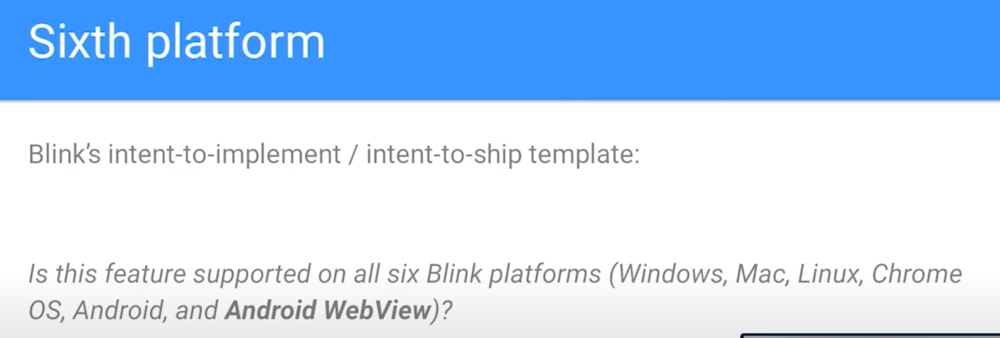
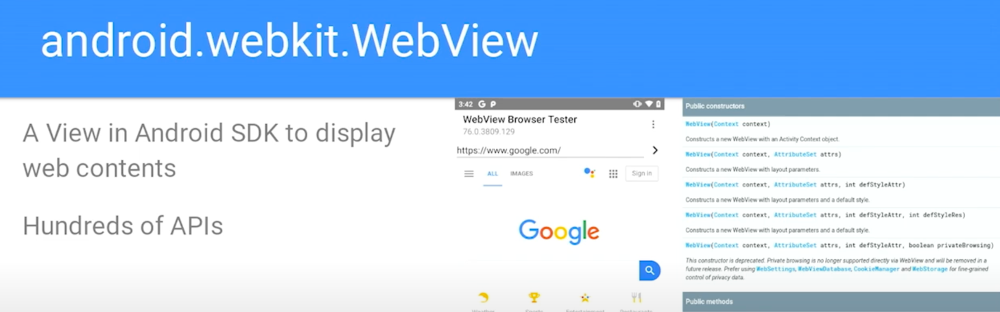
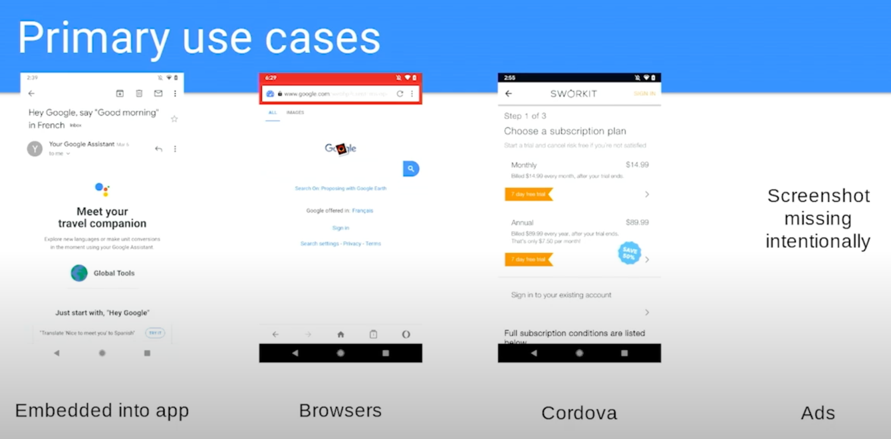
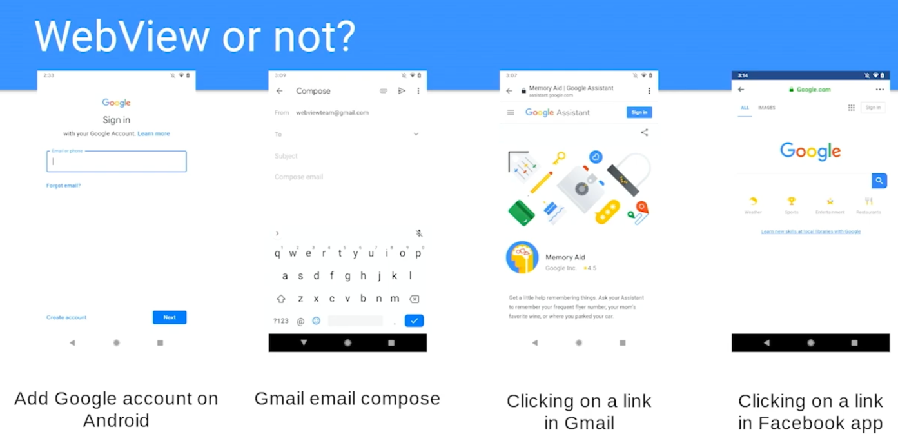
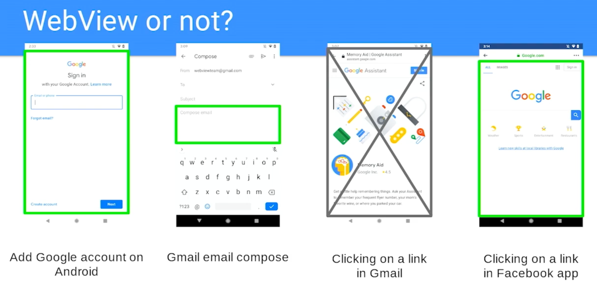

 
WebView V/S Custom Chrome Tab

- If you need user permission for microphone, location etc then we need to use `Custom  Chrome Tab`.
- We can whitelist a domain to use the same app permission in webview to access different things like microphone, location etc, but then we need to trust this website and because of security reason we don't allow and hence we went for custom chrome tab in such cases
- In case of WebView native app has full control. So even if you refresh page then that event is also shared with native app

### WebView

Simple and good explanation of WebView [video + article]: https://www.kirupa.com/apps/webview.htm

- No, WebView is not only for Android.
- While Android does have its own specific implementation called Android System WebView, the concept of a WebView, which is essentially an embedded web browser component within a native application, exists across multiple platforms.
- iOS utilizes WebKit as its underlying engine for rendering web content within apps, including those that leverage a WebView-like component.
- Desktop operating systems
  like Windows, macOS, and Linux also offer various WebView implementations, allowing developers to embed web content within desktop applications. Examples include Electron, which uses Chromium's rendering engine, and WebView2 on Windows, powered by Microsoft Edge's Chromium-based engine.
- Therefore, while the specific implementations and underlying technologies may differ, the general capability of embedding web content within a native application (the core function of a WebView) is available on various platforms beyond just Android.

What is WebView?

WebView or Not

Third image is basically Custom Chrome tab. While in fourth picture facebook decided to show things in webview only

..... go through this video for more details https://www.youtube.com/watch?v=qMvbtcbEkDU

------

