<details >
 <summary style="font-size: x-large; font-weight: bold">LGTM (Loki, Grafana, Tempo & Prometheus)</summary>


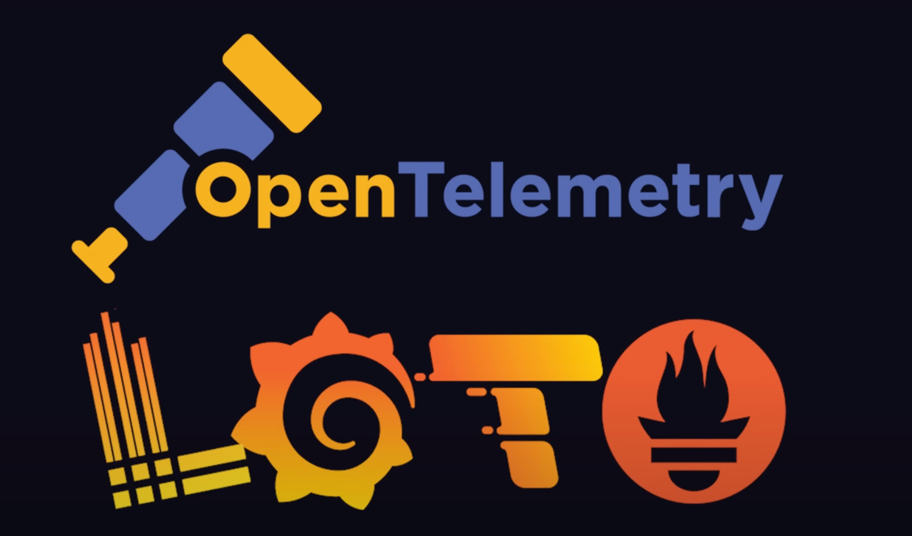

### 1. Open Telemetry
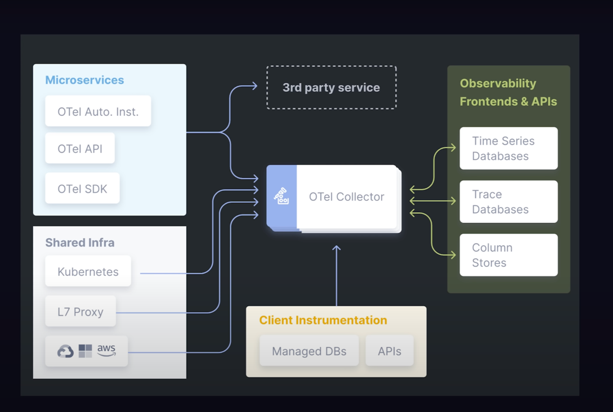
- Industry standard open source tool to collect Metrics, Logs and Traces
- Vendor agnostic meaning uou can use it in any programming language
- 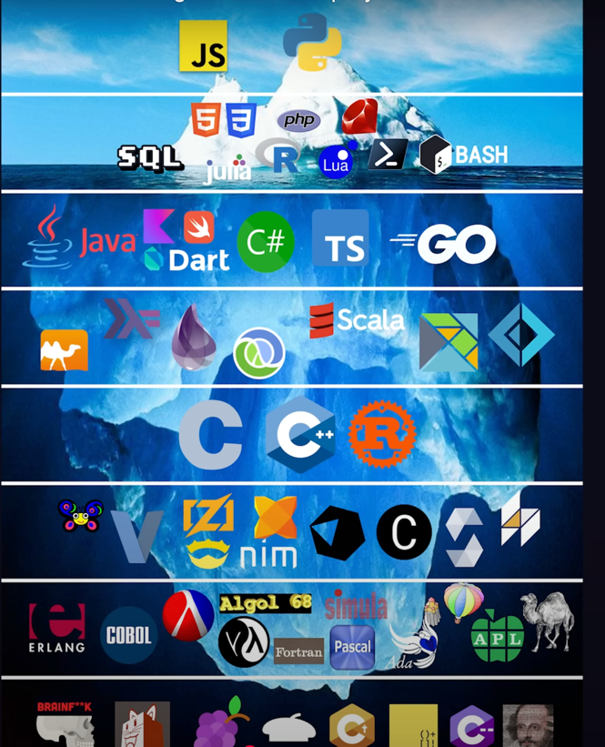
- To view and store above data collected by Open-Telemetry we need a frontend & backend. That's where LGTM stack comes into the picture

### 2. Grafana
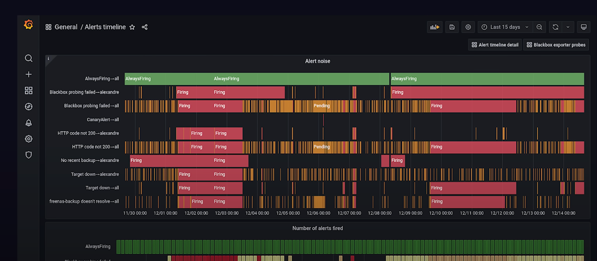
- It is frontend UI to visualize the data
- We can set alerts

### 3. Prometheus

- Time series database to store `METRICS`

### 4. Tempo
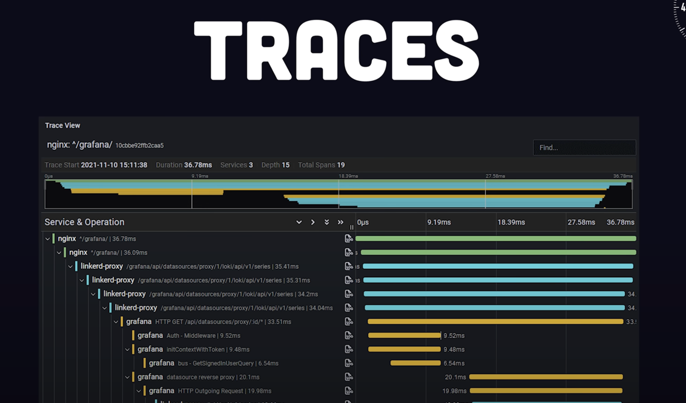
- Database for storing `TRACES`

### 5. Loki

- Database for storing `LOGS`

----
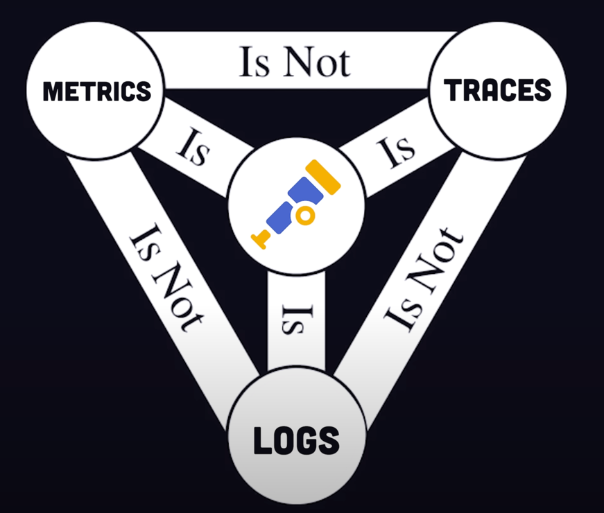
1. Metric
   
- It holds the multiple data points generated over the time like CPU usages

2. Trace
   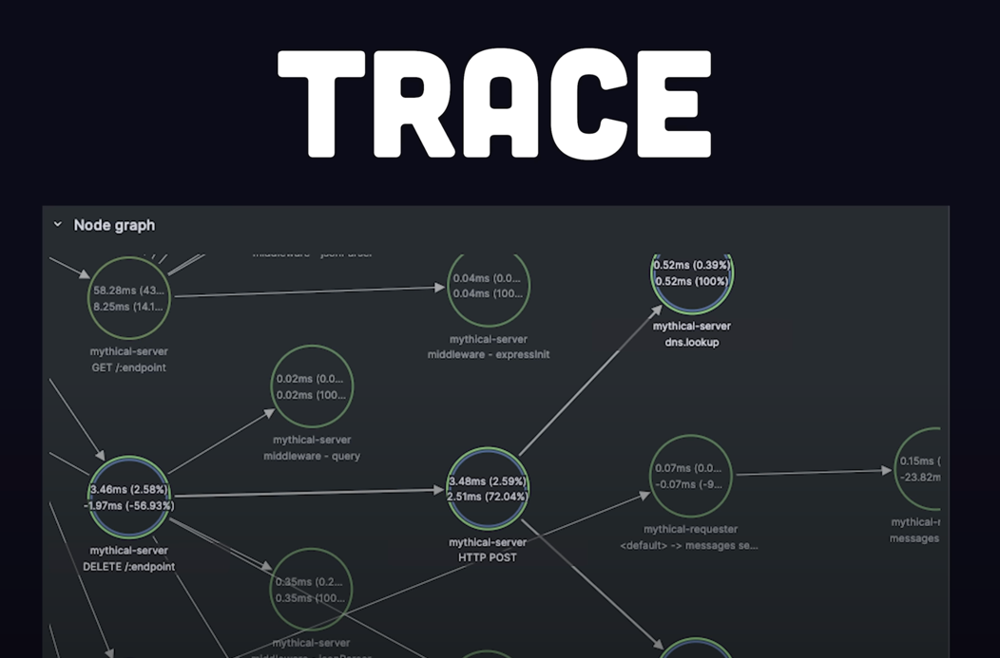
- Traces collects flow of requests done over the time between different services to pinpoint bottleneck

3. Logs
   

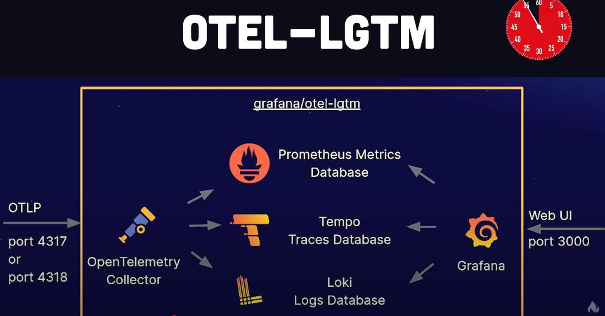


------
</details>


<details >
 <summary style="font-size: x-large; font-weight: bold">Log4JS / Winston / Hive / Hue</summary>

1. Alternative for log4js is `winston`
2. In essence, Hive provides the data warehousing capabilities and the SQL-like query language, while Hue offers a graphical, interactive interface that makes working with Hive and other Hadoop components more accessible and efficient.
3. Hive is a data warehousing solution built on top of Hadoop, designed to facilitate the management and querying of large datasets stored in Hadoop's distributed file system (HDFS). It provides a SQL-like query language called HiveQL, which allows users to perform data analysis and manipulation without needing to write complex MapReduce programs. Hive is particularly useful for batch processing and is often used in big data analytics scenarios.
    1. http://hyd.hue.fkcloud.in/hue/editor?editor=83115
    2. 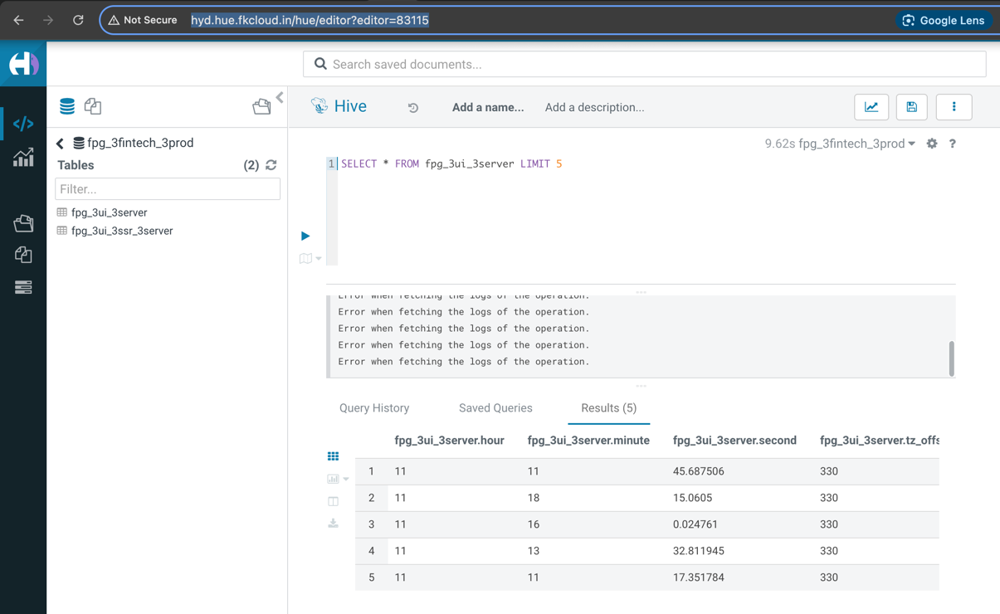

Log4js is a comprehensive JavaScript logging framework, primarily used in Node.js applications, but also applicable in browser environments. It provides a flexible and powerful way to manage and output log messages, similar in concept to the popular Log4j framework in Java.
Key features and functionalities of Log4js include:

- Logging Levels: It supports various logging levels (e.g., TRACE, DEBUG, INFO, WARN, ERROR, FATAL) allowing developers to control the verbosity of log output.
- Appenders: Log4js enables directing log messages to different destinations (appenders), such as the console, files, or even remote services.
- Layouts: It offers various layouts to format log messages, including basic, JSON, and pattern layouts, allowing customization of the log message structure.
- Categories: Log4js supports organizing loggers into categories, providing granular control over logging behavior for different parts of an application.
- File Rolling: For file appenders, it supports log rolling based on size or date, which helps manage log file sizes and prevents them from growing indefinitely.
- Clustering Support: In Node.js applications utilizing clustering, Log4js can transparently handle logging across multiple worker processes, ensuring coordinated log output.
- No Runtime Dependencies: The core JavaScript module of Log4js has no external runtime dependencies, making it lightweight and easy to integrate.

### Hands-On Example

From 2018 Video so check for latest syntax

//log4js.json
Here `categories` can use to define whether to print log just in console or write it to file to save
```json
{
    "appenders": {
    "console" : {
        "type": "console",
        "category": "console"
    },
    
    "file" : {
        "category": "test-file-appender",
        "type": "file",
        "filename": "log_file.log",
        "maxLogSize": 10240,
        "backups": 3,
        "pattern": "%d{dd/MM hh:mm} %-5p %m"
    }
    },
    "categories": {
        "default" :{"appenders": ["console", "file"], "level": "DEBUG"},
        "file" : {"appenders": ["file"], "level": "DEBUG"}
    }
}
```

//log4jsconfig.ts
This file created so that we can just change categories from here and that can reflect in all places where `logger` is added
```ts
export class log4jsconfig{

    static Log(): any {
        var log4js = require('log4js');
        log4js.configure('./config/log4js.json');
        //var logger = log4js.getLogger(); //for both console and file
        let log = log4js.getLogger("default");
        return log;
    }
}
```

//app.ts
```ts
import { browser, element, by } from "protractor";
import { log4jsconfig } from '../config/log4jsconfig'

describe("Calculator test", function(){

    beforeEach(function(){
        browser.get("https://juliemr.github.io/protractor-demo/");
    })

    it("Launch url check", function(){
        expect(browser.getTitle()).toContain("Super");
        //console.log("Browser Title :-" + browser.getTitle());
        let browserTitle = browser.getTitle();

        browserTitle.then(function(txt){
            console.log("Browser Title :-" + txt);
            log4jsconfig.Log().debug("Browser Title :- " + txt);
        });

    })

    it("Add 2 numbers", function(){
        element(by.model("first")).sendKeys("12");
        element(by.model("second")).sendKeys("13");
        element(by.id("gobutton")).click();
        browser.sleep(3000);
        expect<any>(element(by.xpath("//table/tbody/tr[1]/td[3]")).getText()).toEqual('25');
    })

})
```

#### Result
1. Category `default`
   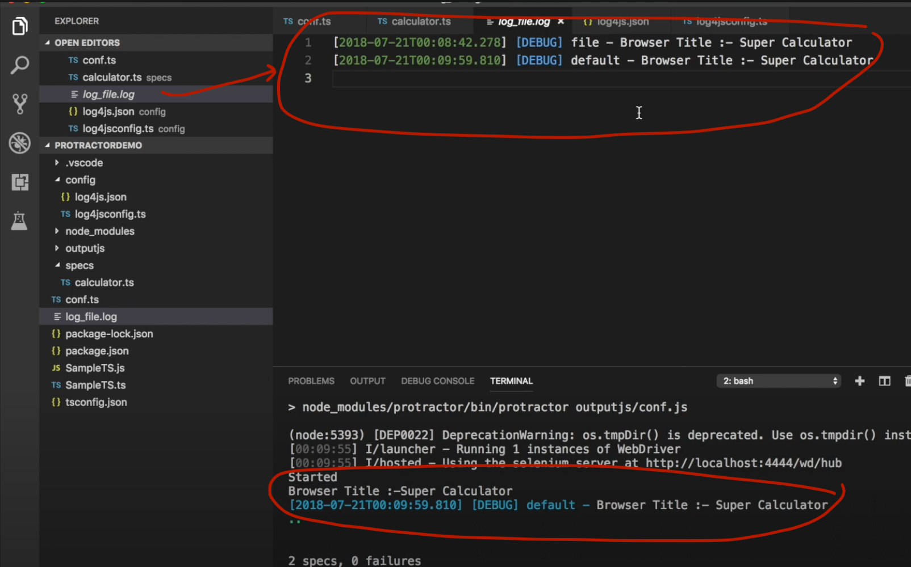
2. Category `file`
   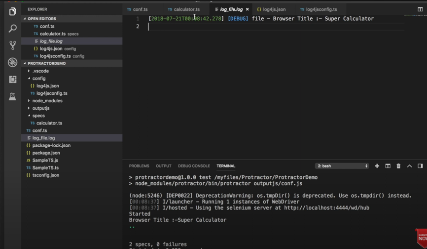

Referred Video: https://www.youtube.com/watch?v=AK5hzEce8gs
Video BLog: https://qavalidation.com/2018/07/protractor-logging-console-output-print-to-log-file.html/

----
</details>