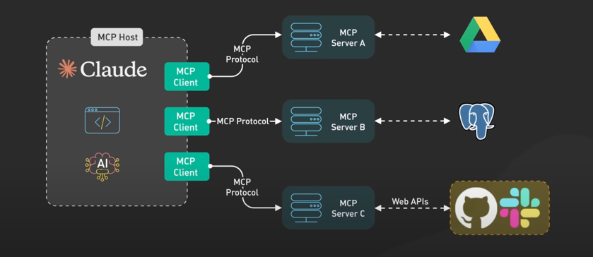
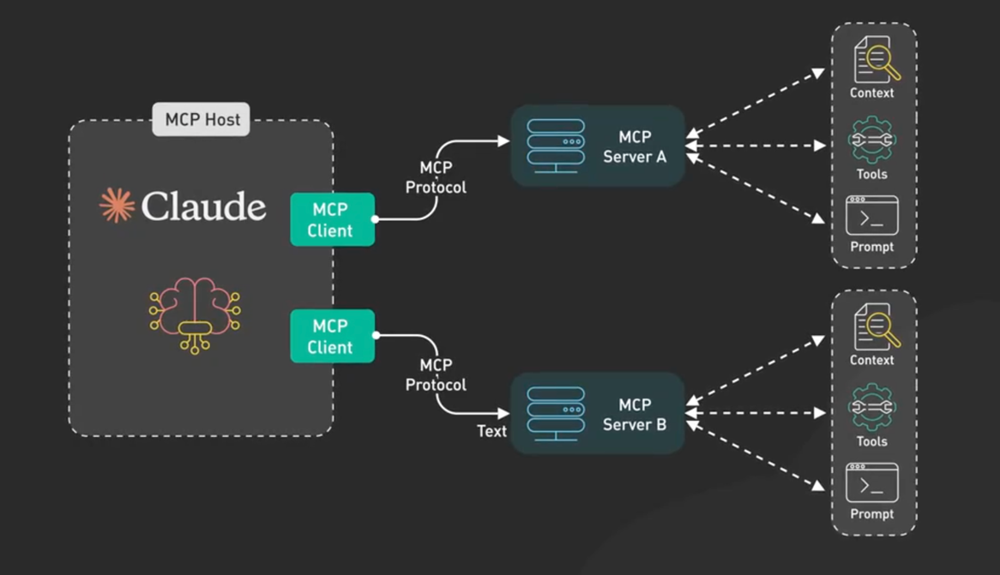
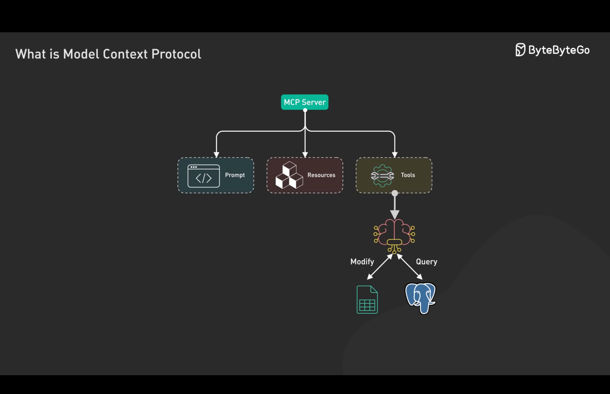

- Manage your context window
- Every prompt does not work for every model. Experiment around with different prompt for different model. Save prompt not the code 
  - Good video explaining same : https://www.youtube.com/watch?v=8rABwKRsec4
- 

 
Context Engineering 

 
Overview 

- **_Knowing limitation of anything is the most important thing to get most out it_**
- **_Understanding AI is much easier if you start understanding how human works_**

### Keep your `Conetxt Window` as lean as possible to get best result

- It is good to add more context at the start of conversation than in the middle because of `primacy bias` & `recency bias`

---

---

---

---

---

---

---

---

---

---

---

---

---

---

---

---

---

---

---

---

---

---

---

- Consider AI Agent to be `Super Talented Junior Engineer` you just need to have `**Mental Alignment**` 
- Rather than reading his code line by line which is not practical

---

---

---

---

---

---

Referred Video: 
- Matt Pocock: https://youtu.be/-uW5-TaVXu4?si=eokaEbTwtFh9xsi0
- YC Humanlayer Talk: https://www.youtube.com/watch?v=IS_y40zY-hc

-----

 
HumanLayer Conext Engineering

- Write as much as failing test to write better code with AI agent. Follow TDD approach
- Read each and everything from your `research` and `plan` steps
- Create the system on how to use AI tools with consistent spec Markdown file
- Be very consistent with your words across your specification. The Same word should mean the same thing across your specification

### Spec -> Research -> Planning -> Implementation

# 🦄 ai that works: Advanced Context Engineering for Coding Agents

> By popular demand, AI That Works #17 will dive deep on a new kind of context engineering: managing research, specs, and planning to get the most of coding agents and coding CLIs. You've heard people bragging about spending thousands/mo on Claude Code, maxing out Amp limits, and much more. Now Dex and Vaibhav are gonna share some tips and tricks for pushing AI coding tools to their absolute limits, while still shipping well-tested, bug-free code. This isn't vibe-coding, this is something completely different.

[Video](https://www.youtube.com/watch?v=42AzKZRNhsk) (1h27m)

## Links

- [The issue we resolved](https://github.com/BoundaryML/baml/issues/1252)
- [Some commands we use at humanlayer](https://github.com/humanlayer/humanlayer/tree/main/.claude/commands)
- [Agents as Spec Compilers](https://x.com/dexhorthy/status/1946586571865800724)
- [How not to use SubAgents](https://x.com/dexhorthy/status/1950288431122436597)
- [CodeLayer early access](https://hlyr.dev/code)
- [The new code - Sean's Talk from AI Engineer](https://www.youtube.com/watch?v=8rABwKRsec4) (the only talk from AIE 2025 with more views than 12-Factor agents :) )
- [Wielding agents - Beyang's talk from AI Engineer](https://www.youtube.com/watch?v=F_RyElT_gJk&t=480s)

## Episode Summary

This week's 🦄 ai that works session was on "Advanced Context Engineering for Coding Agents"!

We covered a ton on how to get the most out of coding agents. Here are key takeaways you can apply today:

- **Use sub-agents for complex tasks:** Instead of one monolithic prompt, decompose the problem. Use specialized prompts for sub-tasks like planning, identifying relevant files, and then generating the code.

- **Use intentional compaction:** Actively manage and shrink your context to keep the agent focused on what's most important.

- **Align language and naming:** Use consistent naming conventions across your codebase to make it easier for the AI to understand the relationships between different parts.

- **Review markdown docs to catch problems BEFORE implementation:** Review the research and plan the agent creates to foster mental alignment and ensure it's on the right track.

- **Practice exploratory coding:** Work alongside your agent to build your own intuition and spot where the AI excels and where it needs guidance.

- **CLAUDE.md > prompts > research > plans > implementation:** Focus human effort on the highest-leverage parts of the pipeline.

- **Phase 1 - Research:** Understanding the problem and how the system works today, including filenames.

- **Phase 2 - Planning:** Building a step-by-step outline of the changes to make.

- **Phase 3 - Implementation:** Executing the plan, testing as you go, ready for surprises along the way.

## The One Thing to Remember

> Context engineering isn't just about cramming more stuff into the prompt; it's a deliberate practice of structuring, compacting, and aligning information to make your AI agent a more effective partner.

## Whiteboards

## Resources

- [Session Recording](https://www.youtube.com/watch?v=42AzKZRNhsk)
- [Discord Community](https://www.boundaryml.com/discord)
- Sign up for the next session on [Luma](https://lu.ma/qvp6ap99)

-----

-----

 
MCP

SDK are available in Python and Typescript

- Referred Video: https://x.com/bytebytego/status/1907838355657863385
- Fireship: https://www.youtube.com/watch?v=HyzlYwjoXOQ

Good MCP Repo:-
1. https://github.com/strowk/mcp-k8s-go
2. https://github.com/punkpeye/awesome-mcp-servers

------

