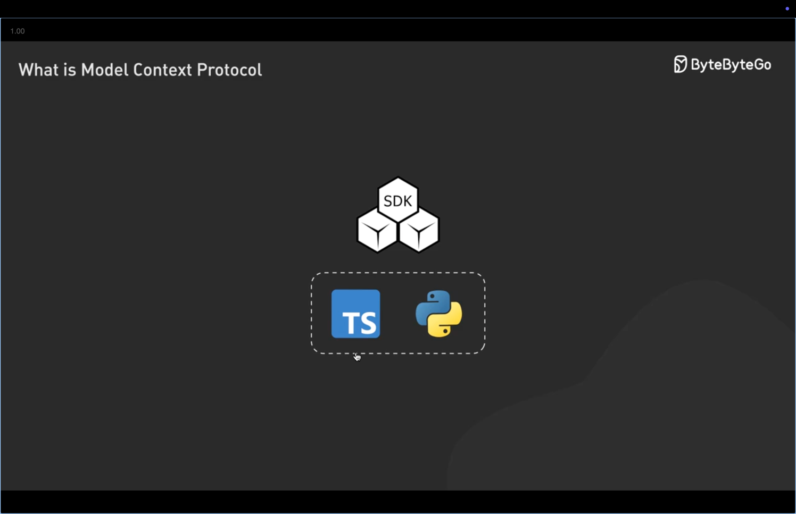

 
Context Engineering 

 
Context Window 

### Keep your `Conetxt Window` as lean as possible to get best result

Referred Video: https://youtu.be/-uW5-TaVXu4?si=eokaEbTwtFh9xsi0

-----

 
HumanLayer Conext Engineering

- Write as much as failing test to write better code with AI agent. Follow TDD approach

-----

-----

 
MCP

SDK are available in Python and Typescript

- Referred Video: https://x.com/bytebytego/status/1907838355657863385
- Fireship: https://www.youtube.com/watch?v=HyzlYwjoXOQ

Good MCP Repo:-
1. https://github.com/strowk/mcp-k8s-go
2. https://github.com/punkpeye/awesome-mcp-servers

------

