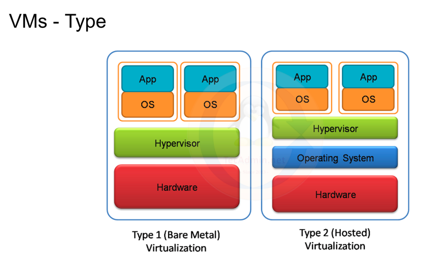

<details >
 <summary style="font-size: x-large; font-weight: bold">Kubernetes</summary>

- Everything in Kubernetes are linked with '`labels`'.
- We create all service, pods, nodes etc with different command independently, but are linked using `Labels`

<details >
 <summary style="font-size: large; font-weight: bold">Theory</summary>

1.


2. Person manually configuring and deploying app


3. Most basic setup for Traditional Deployment


4.


5. Every application over here like Node.JS, Angular etc requires different environments.
   Hence causing Dependency Hell


6. VM Era


7. VM Types
    1. Bare Metal: Are mostly used by companies to optimized their hardware resource
    2. Hosted: Are normal oracle VM running a Linux VM

Dual boot is not an example of bare metal virtualization. Dual booting allows you to install and run two different operating systems on the same computer, but you can only use one at a time. Bare metal virtualization, also known as Type 1 virtualization, involves running a hypervisor directly on the hardware, allowing multiple operating systems (virtual machines) to run concurrently.


8.
Manual Configuration not required since we started using Jenkins to make it work


9. Containerization


> Can a Linux based container run on Windows OS ?
>
>Linux-based containers can run on a Windows host, but it requires virtualization. Docker Desktop for Windows utilizes a lightweight Linux virtual machine (VM) to run Linux containers, leveraging technologies like Hyper-V on Windows. This means the container doesn't directly interact with the Windows kernel, but rather with the kernel of the virtualized Linux environment.

10.


11. Docker (One of the most popular Container Runtime software)

Like `Jfrog` is `Registry` which hold all the images (like Alpine, NGINX etc), HELM charts, NPM Packages etc

- `Image` are like `Class` which does not take any memory but just the blue print.
- `Container` are the one which get instantiated using `Image`


`Dockerfile`

In first line we are first getting base image of a OS
```dockerfile
FROM jfrog.fkinternal.com/fk-base-images/nodejs:20.9.0-debian11.8

USER root

# Define the build argument
ARG BUILD_ENV

RUN echo "Asia/Kolkata" > /etc/timezone
RUN dpkg-reconfigure -f noninteractive tzdata

RUN echo "deb [trusted=yes] http://packages.reposvc-prod.fkcloud.in/repos/fk-config-service-confd/73 /" > /etc/apt/sources.list.d/confd.list

COPY ./confd/conf.d/fpg-ui.conf.toml /etc/confd/conf.d/fpg-ui.conf.toml
COPY ./confd/templates/fpg-ui.conf.tmpl /etc/confd/templates/fpg-ui.conf.tmpl

RUN sed -i "s/{{BUILD_ENV}}/$BUILD_ENV/g" /etc/confd/conf.d/fpg-ui.conf.toml

RUN apt-get update && \
	apt-get install -y --allow-unauthenticated \
	procps \
	lsof \ 
	sudo \
	apache2-utils \
	curl \
    sed \
	net-tools \
	vim \
	fk-config-service-confd \
	--no-install-recommends && \
	apt-get clean && \
	apt-get autoremove --yes && \
	rm -rf /var/lib/apt/lists/*

RUN groupadd -g 3000 fpg-ui && \
	adduser --gecos "FPG UI Dev" \
	--gid 3000 \
	--no-create-home \
	--shell /bin/bash \
	--disabled-login \
	--uid 3002 \
	fpg-ui-dev

RUN sudo usermod -aG sudo fpg-ui-dev

WORKDIR /app

RUN mkdir -p /home/fpg-ui-dev/.pm2 && \
	chown -R fpg-ui-dev:fpg-ui /home/fpg-ui-dev/.pm2

USER fpg-ui-dev

COPY  package-lock.json ./
COPY  node_modules ./node_modules/
COPY  --chown=fpg-ui-dev:fpg-ui package.json ./
COPY  --chown=fpg-ui-dev:fpg-ui conf ./conf
COPY  --chown=fpg-ui-dev:fpg-ui dist ./dist
COPY  --chown=fpg-ui-dev:fpg-ui ecosystem.json ./
COPY  --chown=fpg-ui-dev:fpg-ui init.sh ./init.sh
COPY --chown=fpg-ui-dev:fpg-ui confd ./confd

ENV PORT=8080 NODE_ENV=production

EXPOSE $PORT

RUN chmod 755 ./init.sh
CMD ./init.sh
```

12.

- Scalability is not full solved because we need to build each `container` one by one manually which tedious task


13.


14.


- Kubernetes act as **orchestrator** for all the `containers`
- Each `Node` has multiple `Pods`
- Only `Master Node` does not have any `Pods`. It has different set of service to manage all the `Worker Nodes`
- A `Pod` can contain multiple `Container`. But it is advised to keep one `Container` in one `Pod`
- We may want to run more than one `Container` which are called `SideCar` which has different services to support main container in a pod
- Kuberenete are not limited to Docker, it can run with other container runtime software
- In Master Node
    - `etcd`: It store Key Value pair
    - API Server: It is used to communicate with `kubelet` in worker Node. We use `kubectl` command to do this
- `Kubelet`: It is a manager for a single node

15.

- Calvin DC run on Bare Metal to make everything cost effective
  

16.


17.


#### Resources
https://collabnix.github.io/kubelabs/


-----
</details>

<details >
 <summary style="font-size: large; font-weight: bold">Anurag's Notes on Kubernetes</summary>

# Kubernetes Touch Base


This is a demo for app containerization and orchestration using Kubernetes with Docker as container runtime.

## Setup

Clone this repo to your workspace


```bash
cd k8-demo
```

Install Node Modules
```bash
npm i
```

## Running Locally


This app use port `3000` . Ensure no other process is using the port.

```bash
npm start
```

Go to http://localhost:3000. You should see the home page for the app.


## Containerisation

### Prequisite

- You should have [Rancher Desktop](https://rancherdesktop.io/) installed on your system. It's open-source application that provides all the essentials to work with containers and Kubernetes on the desktop
- Your private [docker hub](https://hub.docker.com/) account. Create a repo public or private.


### Dockerising the App


#### Build Image

We will use the Dockerfile to create docker image.

```bash
docker build .
```

This would create a Docker Image without any tag.

Add a tag using below command.

```bash
# Add the tag
docker tag {{imageId}} {{yourRepository}}:{{tag}}

# e.g. docker tag imageId anandanurag/k8-demo-repo:latest
```

```bash
# Verify the creation. You should see the image listed.

docker images | grep {{yourRepository}}

# e.g. docker images | grep anandanurag/k8-demo-repo
```

#### Create container

```bash
docker run -d -p {{hostMachinePort}}:{{containerPort}} --name {{containerName}} {{repository}}:{{tag}}

# e.g. docker run -d -p 8080:3000 --name docker-demo-container anandanurag/k8-demo-repo:latest
```

```bash
# Verify if container is running
docker ps | grep {{containerName}}

# e.g. docker ps | grep docker-demo-container
```

You should now be able to access you containerized app at http://localhost:8080. Instead of 8080, use your `{{containerPort}}`

#### Stop Container

```bash
docker stop {{containerName}}

# e.g. docker stop docker-demo-container
```

### Push Image to Dockerhub

#### Login to your Repo

```bash
docker login
```
Enter username and password

#### Push Image

```bash
docker push {{yourRepository}}:{{tag}}

# e.g. docker push imageId anandanurag/k8-demo-repo:latest
```
This will push your image to your personal repo in Dockerhub. The same image from dockerHub we will use for creating containers within Kubernetes cluster.

You may delete your local image
```bash
docker rmi {{yourRepository}}:{{tag}}

# e.g. docker rmi anandanurag/k8-demo-repo:latest
```

### Orchestration


#### List Node

```bash
kubectl get nodes -o wide
```


You would see a single master node


#### Create a namespace

```bash
kubectl apply -f ./manifests/namespace.yaml

# check 
kubectl get ns | grep k8-demo-ns
```

#### Change cluster context

Set current context to above created namespace

```bash
kubectl config set-context --current --namespace=k8-demo-ns
```

#### Create a Pod

##### Prerequisite
If you have created private repo in github. This step is required. This creates a secret which would be used while pull images from the dockerhub.

```
kubectl create secret docker-registry regcred --docker-server={{registry_server}} --docker-username={{username}} --docker-password={{password}} --docker-email={{email}}
```
--docker-server=https://index.docker.io/v1

Apply Pod manifest file
```bash
kubectl apply -f ./manifests/pod.yaml

# check
kubectl get pods
```

#### Create a Service

A service is needed in order to access your Pods.

##### ClusterIP

```bash
kubectl apply -f ./manifests/service.yaml

# check
kubectl get svc | grep k8-demo-svc
```

By default, Kubernetes creates a service of type ClusterIP. Cluster IPs are by design accessible only within cluster. However, RD provides a way to proxy your Cluster IP using Port Forwarding.


You can assign any port e.g. 60718.

Now, you can visit your app at http://localhost:60718


We `curl` into the Pod to access service layer IP to see our Node.Js app running

##### NodePort

```bash
kubectl apply -f ./manifests/service-node-port.yaml
```
Get Node port of your NodePort
```bash
kubectl get svc | grep k8-demo-svc-np
```

Get External IP of your node
```bash
kubectl get nodes -o wide
```

Now your app should be accessible at `http://<EXTERNAL IP>:<NODE PORT>` e.g. http://192.168.1.11:30367

An external client can access an application deployed in Kubernetes by connecting to the external IP address of any worker node in the cluster and the assigned NodePort. For example, if a NodePort service is configured with nodePort: 31000 and a worker node has an external IP of 192.168.1.10, an external client could access the application by connecting to 192.168.1.10:31000

### Scaling

#### Deployment

Delete your old pods

```bash
kubectl delete pod k8-demo-pod
```

Apply deployment manifest to create pods with 3 replica sets
```bash
kubectl apply -f ./manifests/deployment.yaml 

#check
kubectl get deployment
```

### Sidecars

Sidecar containers are the secondary containers that run along with the main application container within the same Pod. These containers are used to enhance or to extend the functionality of the main application container by providing additional services, or functionality such as logging, monitoring, security, or data synchronization, without directly altering the primary application code.


Delete your old deployment
```bash
kubectl delete deployment k8-demo-deployment
```

```bash
kubectl apply -f ./manifests/pod-with-sidecar.yaml 
```

Exec to the Pod
```bash
kubectl exec -it k8-demo-pod -- sh

# Tail the Data being injected by the sidecar
tail -f /data/log.txt

# Exit
exit
```


----
</details>


- Good Resources:
    - https://collabnix.github.io/kubelabs/Kubernetes_Architecture.html
    - https://collabnix.github.io/kubelabs/
- Video: https://drive.google.com/file/d/1yKZjc-mhy5VRBaIic5MDf8-zg1b6WEeI/view?usp=sharing
- Repo: https://github.fkinternal.com/anurag-anand/k8-demo
<details >
 <summary style="font-size: large; font-weight: bold">Issues</summary>

You're getting the `ErrImagePull` status because your Kubernetes cluster cannot fetch the container image specified in your `pod.yaml` file.

Even though the image `anjaysahoofk/k8-demo-repo:latest` exists on your local machine's Docker daemon, your Kubernetes cluster (likely running in a separate environment like Rancher Desktop) can't access it directly from your host's image cache. It tries to pull the image from a remote registry (like Docker Hub) and fails.

---
## 🕵️‍♂️ Primary Causes and Solutions

Here are the most common reasons for this error and how to fix them:

### 1. Incorrect `imagePullPolicy`
For images with the `:latest` tag, the default `imagePullPolicy` is `Always`. This forces Kubernetes to try and download the image from the remote repository every time, even if a version is cached within the cluster.

* **Solution:** Change the pull policy to `IfNotPresent`. This tells Kubernetes to use a locally cached image within the cluster if it exists, and only pull from the remote registry if it doesn't.

  **Update your `pod.yaml`:**
    ```yaml
    apiVersion: v1
    kind: Pod
    metadata:
      name: k8-demo-pod
      namespace: k8-demo-ns
      labels:
        app: k8-demo
    spec:
      containers:
      - name: k8-demo-container
        image: anjaysahoofk/k8-demo-repo:latest
        imagePullPolicy: IfNotPresent # <-- Add this line
        ports:
        - containerPort: 3000
      imagePullSecrets:
      - name: regcred
    ```

### 2. Private Repository Secret Issue 🔑
Your `pod.yaml` specifies `imagePullSecrets: - name: regcred`. This implies the image is in a private repository. The `ErrImagePull` can occur if:
* The secret `regcred` does not exist in the same namespace as the pod (`k8-demo-ns`).
* The credentials within the `regcred` secret are incorrect or have expired.

* **Solution:**
    1.  First, run `kubectl describe pod k8-demo-pod -n k8-demo-ns`. The output at the bottom, in the `Events` section, will give a more detailed error message, often explicitly stating if the secret is missing or invalid.
    2.  Verify the secret exists in the correct namespace:
        ```bash
        kubectl get secret regcred -n k8-demo-ns
        ```
    3.  If the image is public, you can remove the `imagePullSecrets` section entirely.

### 3. Image Not Available to the Cluster Environment 📦
Local Kubernetes tools like Rancher Desktop or Minikube use their own container runtime environment, which is separate from your host machine's Docker. The image needs to be loaded into the cluster's internal cache.

* **Solution (for Rancher Desktop):** You can use `nerdctl` (which is included with Rancher Desktop) to load your locally built image into the cluster's context.
    ```bash
    nerdctl --namespace k8s.io image load < my_image.tar
    ```
  *First, you would save your Docker image to a `.tar` file using `docker save anjaysahoofk/k8-demo-repo:latest -o my_image.tar`.*

However, **the simplest and most common fix is to adjust the `imagePullPolicy` as described in the first point.**

-----

Helm Chart Explanation: https://www.youtube.com/watch?v=fy8SHvNZGeE

</details>

-----
</details>

