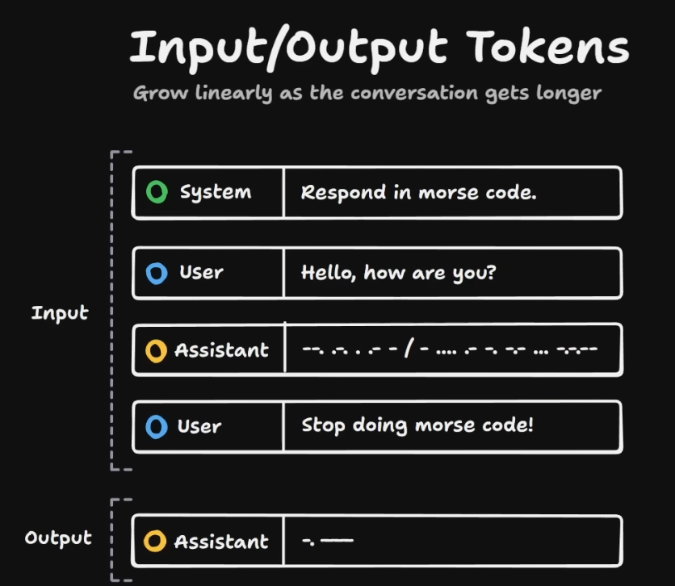
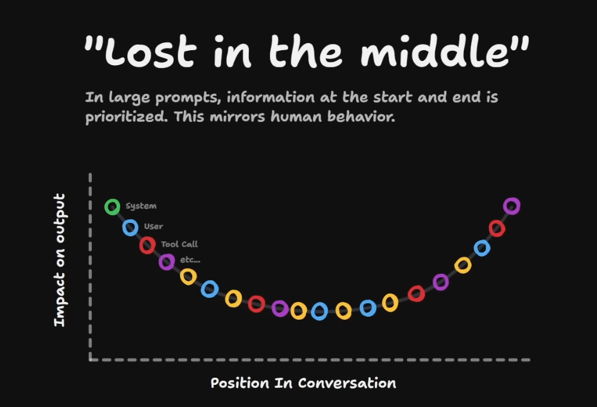
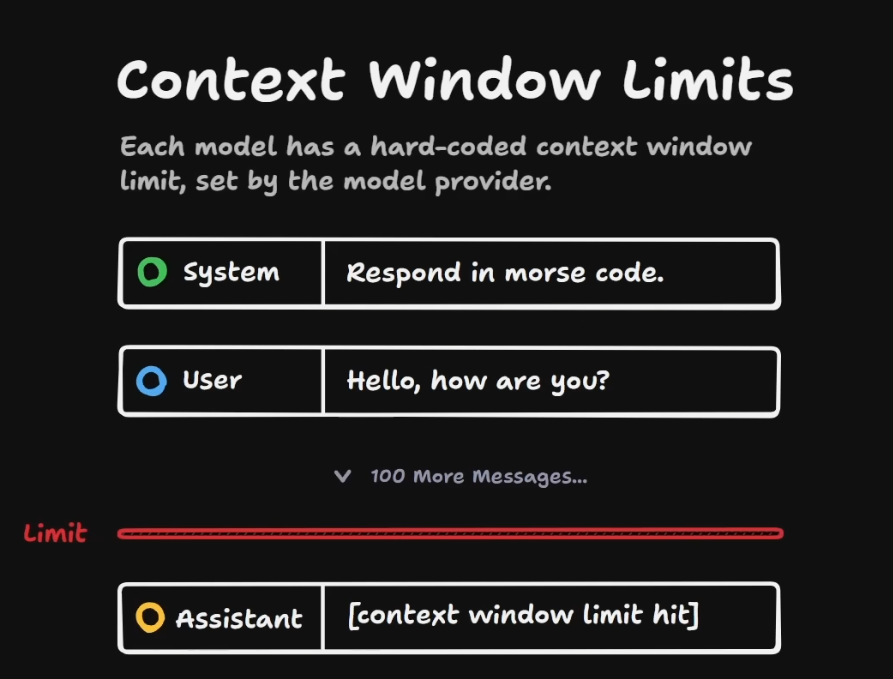

 
Context Engineering 

 
Context Window 

### Keep your `Conetxt Window` as lean as possible to get best result

Referred Video: https://youtu.be/-uW5-TaVXu4?si=eokaEbTwtFh9xsi0

-----

 
HumanLayer Conext Engineering

- Write as much as failing test to write better code with AI agent. Follow TDD approach

-----

-----

